

<!-- $\newcommand{sq}[1]{
  ~\raise{-1pt}{
    \style{height: 15px; content: url('img/sqF-#1.png')}{
      {~\over~}\over~
    }
  }~
}
\newcommand{cards}[1]{
  ~\raise{-4pt}{
    \style{height: 23px; content: url('img/card-#1.png')}{
      {{~~\over~~}\over{~~\over~~}}\over{~~\over~~}
    }
  }~~~
}
$ -->

Symmetry
=========

Consider a square. Is it symmetric? How is it symmetric? How much symmetry does it have? What kind of symmetry does it have?

What do those questions even mean?

If you ask someone, they might tell you that a square has *rotational symmetry*. If you rotate a square by 90°, it's the same shape. Without knowing which corner was which, it would seem the exact same as it was before. You could lift it up, rotate it, and set it back down so that it covers the exact same space.

Let's call this rotation transformation $r$. To be precise, $r$ rotates a square clockwise by 90°. For example, $r\sq{e} = \sq{r}$. (The "F" on the square is there to let us determine orientation and see transformations.)

You might also be told that a square has *horizontal symmetry* or *vertical symmetry*. You can flip a square horizontally or vertically and still have a square. Let's focus on horizontal symmetry for now. We'll call horizontal flips $s$. $s$ performs a reflection across a vertical line through the middle of the square. For example, $s\sq{e} = \sq{s}$.

We now have two transformations, $r$ and $s$, which transform squares into another square of the same shape. It turns out that these two transformations form a kind of "basis" for all the others. By using them in some pattern, you can build the other transformations, like vertical flipping.

Starting with our original square $\sq{e}$ in the bottom left corner, the following graph shows the transformed versions generated by combining $r$ and $s$ in different ways. $r$ and $s$ are represented by arrows of different colors. $r$ arrows are colored blue and $s$ arrows are colored red.

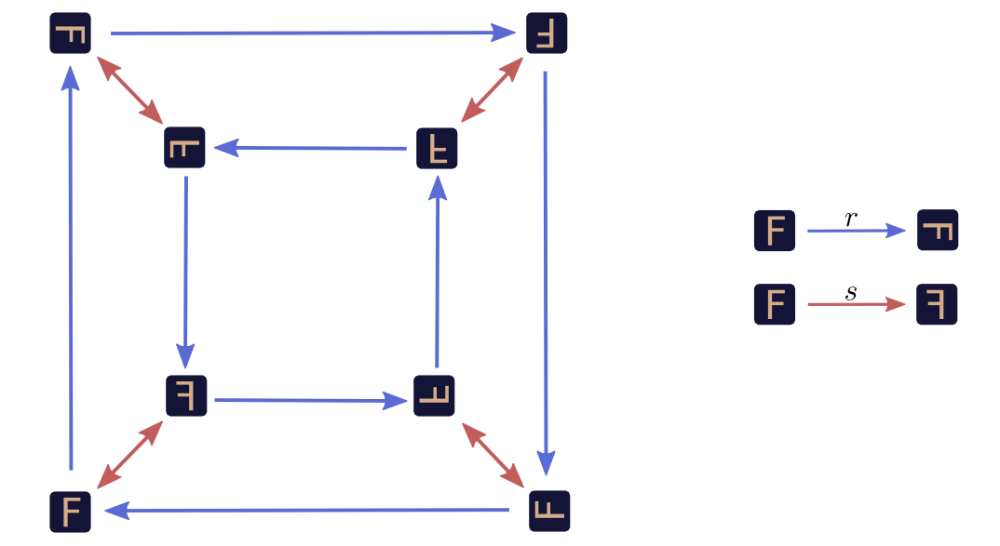

We can use the graph to investigate what happens if we perform a sequence of transformations. For example, what happens if we rotate, flip and then rotate again? Well, we start at our original square, $\sq{e}$, and trace: $\sq{e} \xrightarrow{r} \sq{r} \xrightarrow{s} \sq{r3s} \xrightarrow{r} \sq{s}$. In the end, we're left with just  horizontally flipped version of the original, $s\sq{e} = \sq{s}$. If we want to express this surprising fact, we can use multiplication like notation: $rsr \sq{e} = s \sq{e}$.

If we want to think about our graph a bit more abstractly, we can factor apart the transformation and the original square (eg. $\sq{r2s} \to r^2s\sq{e}$).

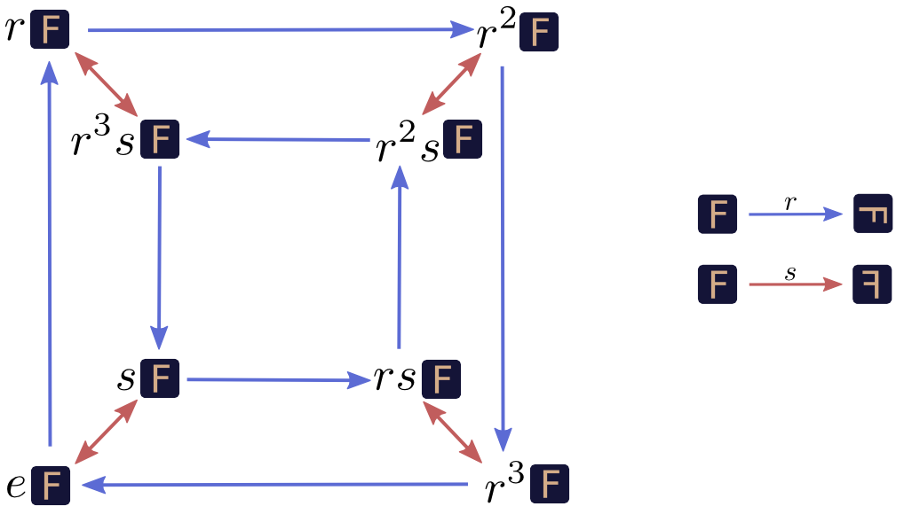

Here, $e$ is the *identity transformation*, which doesn't transform the object at all. For example $e\sq{e} = \sq{e}$.

We can go a bit further. The original square, $\sq{e}$, seems a bit unnecessary in $rsr \sq{e} = s \sq{e}$. Why not just say $rsr = s$? We can just drop the factored out $\sq{e}$, both in equations and our graph.

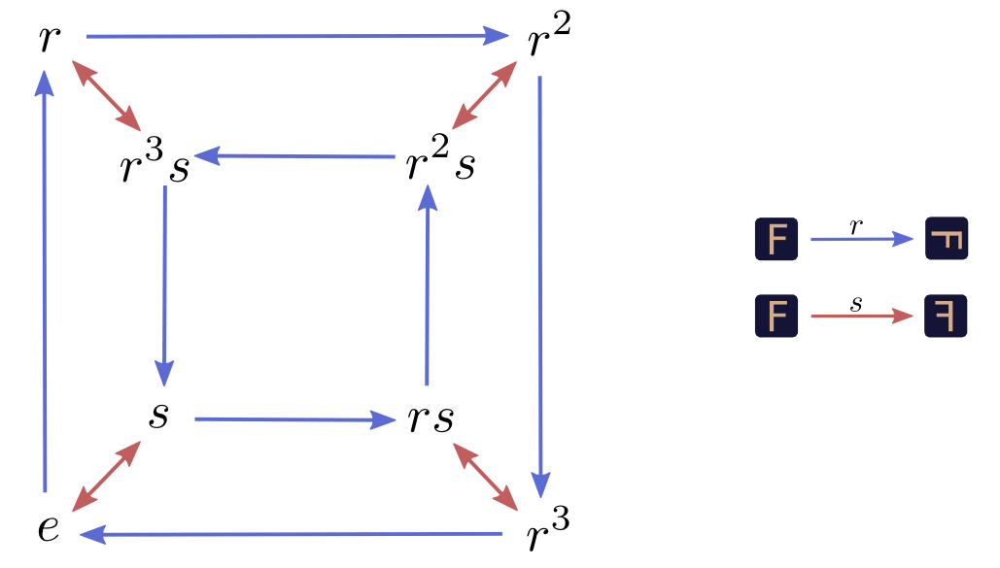

Now, here's the essential realization: $r$ and $s$ could have been other things and we would have had the exact same graph. $r$ could have been rotating 90° *counter*clockwise. $s$ could have been vertical flips. Or we could have been transforming an entirely different kind of object. All that matters is the relationship between $r$ and $s$, how they interact. What we saw with the squares was just one particular way this graph, this abstract pattern, could appear in the real world.

Mathematicians call these abstract patterns *groups*. There is an entire field of math dedicated to them. Connections between a group and an object like the square are called *group actions*.

But... What is a group?
=======================

Not all graphs are groups. Only a very special kind of graph is. (We won't give a precise definition here, but we will get a good feel for it.)

Firstly, the graph is directed (the edges are arrows) and has colored edges. At every vertex, exactly one arrow of a given color comes out and one goes in.

But the key property of these graphs is more subtle. We created our graph by starting with an original square, $\sq{e}$. But what if we said the original square was $\sq{s} = s\sq{e}$?

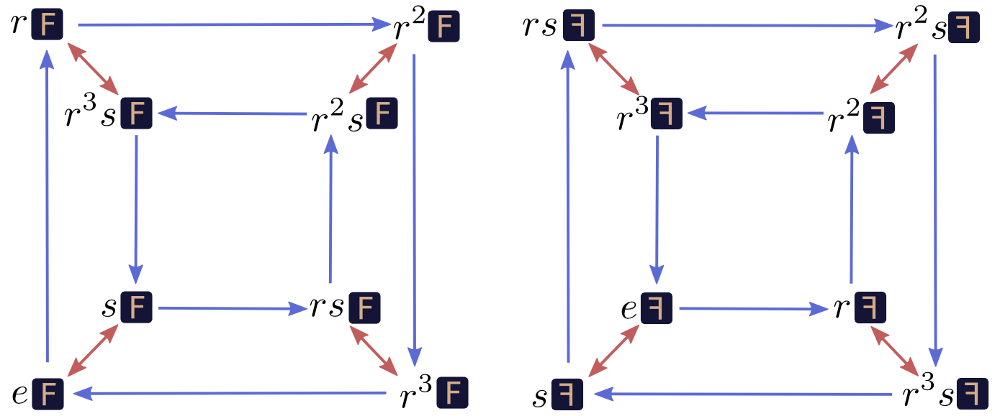

Which position we say is the "initial" position is arbitrary. No matter which position you think of as the initial one, the graph is the same. The graph is perfectly symmetrical, in some sense.[^EmbeddingSymb] Imagine that the edges are paths of different color you can walk on, and you're standing on one of the nodes: from your perspective the graph is the same no matter which node you're standing on. No matter which node you're on, taking a red path, a blue path, and then a red path and then a blue path again will bring you back to where you started.

[^EmbeddingSymb]: Note that the graph embedding isn't necessarily symmetrical.

In Euclidean space, we reason about points by their relative position to an origin. Similarly, in our group, we pick some origin (eg. $\sq{e}$) and talk about points by their relative positions. We call these relative positions (such as $r$, $s$, or $r^3s$), the *elements* of the group.

Just like we can add difference vectors of points, we can "add" elements of a group together. It isn't *actually* addition, of course, but it is a natural way to combine elements of the group. Sometimes we talk about it by analogy with addition and write combining two elements $a$ and $b$ as $a+b$, while other times we make analogies to multiplication and write $a\cdot b$.

"Adding" or "multiplying" two group elements is actually quite similar to vector addition. We decide that one point on the graph is our identity element (the original position), and find the two elements we want to multiply, $a$ and $b$. We pick paths from the identity to $a$ and $b$. Then we stick the $a$ path on to the end of $b$, to bring us to $a+b$ or $a\cdot b$ (depending on the chosen notation).

The Algebraic Perspective
==========================

The above is almost unrecognizable as group theory, from a traditional perspective. Historically, group theory was motivated by a desire to abstract.

As we began to study more kinds of mathematical objects, we began to see patterns between them. For example, in arithmetic, we see $a\!\cdot\!(b+c) ~=~ a\!\cdot\! b ~+~ a\!\cdot\! c$ and in set theory we see $A\cap (B \cup C) = A\cap B ~\cup~ A\cap C$. There are many other examples of this pattern, and many other patterns.

We also noticed that many important results are true for a broad class of objects observing a certain pattern. Knowing that a mathematical object obeys that pattern is sufficient to prove the result holds.

So, we formalized those patterns into what we call *algebraic structures*.[^AnalysisStructures] There's a **lot** of them, and you can find a [very long list on wikipedia](http://en.wikipedia.org/wiki/List_of_algebraic_structures). We can study an algebraic structure and prove results that hold for any instance of that structure. (Programmers and computer scientists can see this as making mathematics polymorphic.[^polymorphism])

[^AnalysisStructures]: Unfortunately, some similar abstract mathematical structures go by different names, particularly in analysis. For example: [metric spaces](http://en.wikipedia.org/wiki/Metric_space), [topological spaces](http://en.wikipedia.org/wiki/Topological_space) and [measure spaces](http://en.wikipedia.org/wiki/Measure_(mathematics)).

[^polymorphism]:
    This is actually a very deep analogy. In programming, we often try to write polymorphic functions that can act on many kinds of objects. In mathematics, we're trying to make polymorphic proofs that can operate on different kinds of mathematical object. The [Curry–Howard correspondence](http://en.wikipedia.org/wiki/Curry%E2%80%93Howard_correspondence) formalizes this connection between functions and proofs.

    (Some programming languages, like Haskell, even have implementations of common algebraic structures as classes!)

    It's also worth noting that, just as most approaches to polymorphism in programming give us subclasses and superclasses, algebraic structures also kind of have "sub-structures" and "super-structures".

We can now give the classical definition of a group. Don't worry too much if you have trouble following.

**Definition:** A group $G = (S, ~\cdot~)$ is a set $S$ equipped with a binary operation $(~\cdot~)$ with the following properties:

* For all $a,b \in S$, the new element $a\!\cdot\!b$, is also in $S$.
* There exists an identity element, $e \in S$, such that $e\cdot x ~=~ x \cdot e ~=~ x$ for all $x \in S$.
* For all elements $x \in S$, there exists an inverse element $x^{-1} \in S$ such that $x\cdot x^{-1} = x^{-1}\cdot x = e$.
* The operation $(~\cdot~)$ is associative. That is, $(a\cdot b)\cdot c ~=~ a\cdot (b\cdot c)$ for all $a,b,c \in S$,

Why those rules? Why not more or less? Well, we could define a group to have more or less requirements. If it was weaker, had less requirements, more kinds of objects would be groups and the results we prove about groups would be more broadly applicable. If it was stronger, had more requirements, we would be talking about a more specific kind of object and could prove more about them. In mathematics one often balances generality and specificity like this.

Mathematicians study both weaker and stronger versions of groups. But, somehow, groups are special. They aren't too hot, they aren't too cold: they're just right.

This might seem kind of arbitrary. Why should these particular rules be a particularly good collection? One thing that I find very helpful and motivating is realizing that they're equivalent to the requirements we made when we were thinking of groups as graphs. Identity corresponds to there being a starting point, inverses to being able to go backwards on arrows, and associativity is equivalent to the perfect symmetry of the graph.[^GroupDefEquivelance]

[^GroupDefEquivelance]: 

    The associativity part is a bit tricky to see, especially because we never rigorously defined the "perfect symmetry" of our "group graphs."

    One definition is that, given a loop originating at $e$ on the graph, $((bc)d)... = e$, that same sequence is also a loop if it starts at a point $a$, that is $(((ab)c)d)... = a$. It's pretty straightforward to see that this follows from associativity, but what about the other direction? 

    Well, we want to prove for all $a,b,c$, that, $a(bc) = (ab)c$. Let $d = (bc)^{-1}$, the reverse of the path to $bc$. Then $(bc)d = e$ is a loop. By the graph symmetry, $((ab)c)d = a$. We now right-mulitply by $d^{-1} = (bc)$ to get $(ab)c = a(bc)$, which is associativity.

A Group from Three Cards
========================

Consider three cards, $\cards{123}$. There are some natural transformations we can do to them. We'll call the operation of switching the first two cards $(12)$. Similarly, we'll call the operation of switching the second cards $(23)$. So,

$$(12)\cards{123} = \cards{213} ~~~~~~~~~~~~~~~~~~~~~~~~ (23)\cards{123} = \cards{132}$$

Together, these two operations generate a group, the [Symmetric Group] on 3 symbols, $S_3$.

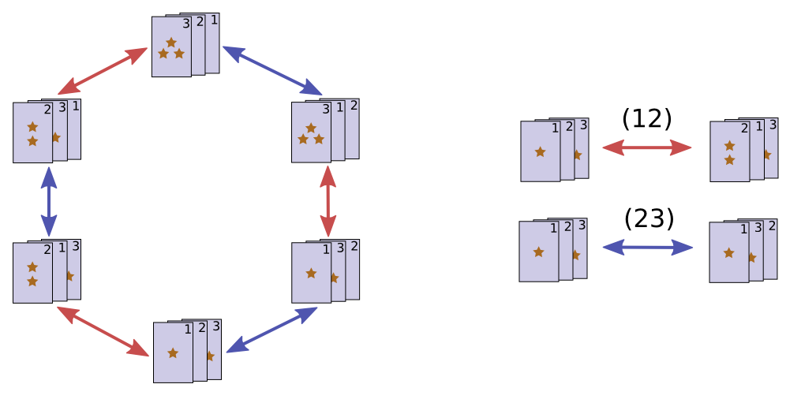

Each group element is a particular way to rearrange the cards, a permutation.

[Symmetric Group]: http://en.wikipedia.org/wiki/Symmetric_group

Shuffling Cards
===============

One interesting thing to think about is shuffling. When we shuffle cards, we try to put them in a random ordering, a random permutation. This means we create a probability distribution over the group.

Ideally, our shuffle would give us a uniform distribution -- every permutation would be equally likely. But we can easily imagine an imperfect shuffle, where some permutations are more likely than others.

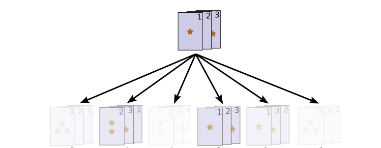

Of course, if the first shuffle doesn't randomize them, we can shuffle again!

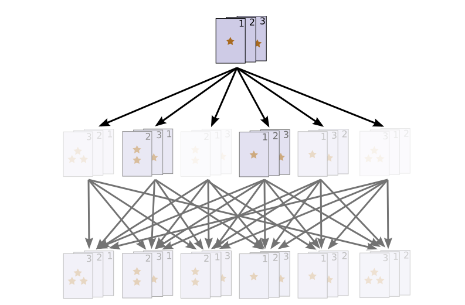

Generally, repeated shuffles will cause probability mass to diffuse, bringing us closer to the uniform distribution.[^diaconis] 

[^diaconis]: How many times do you have to shuffle a deck of cards to make it truly random? This question was explored by the mathematician Persi Diaconis.

This should feel similar to the falling ball example in the [Understanding Convolutions post](../2014-07-Understanding-Convolutions/). Fundamentally, they are the same thing: convolution.

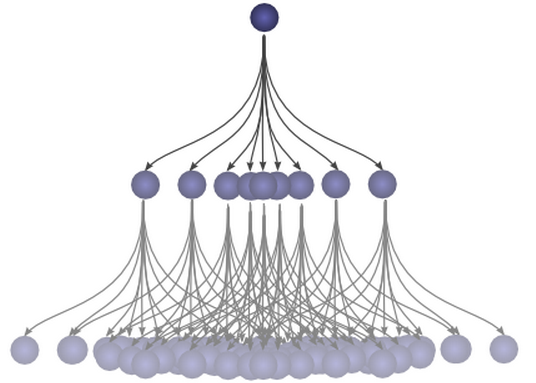

Group Convolutions
==================

The earlier visualizations of probability distributions on the permutations were kind of messy. The natural way to visualize it is on the Cayley diagram!

Let's consider a very simple probability distribution. 40% of the time we apply the operation $(12)$, permuting our cards to $\cards{213}$. 60% of the time we apply $(23)$, permuting our cards to $\cards{132}$. That's a terrible shuffle, but it is easy to think about.

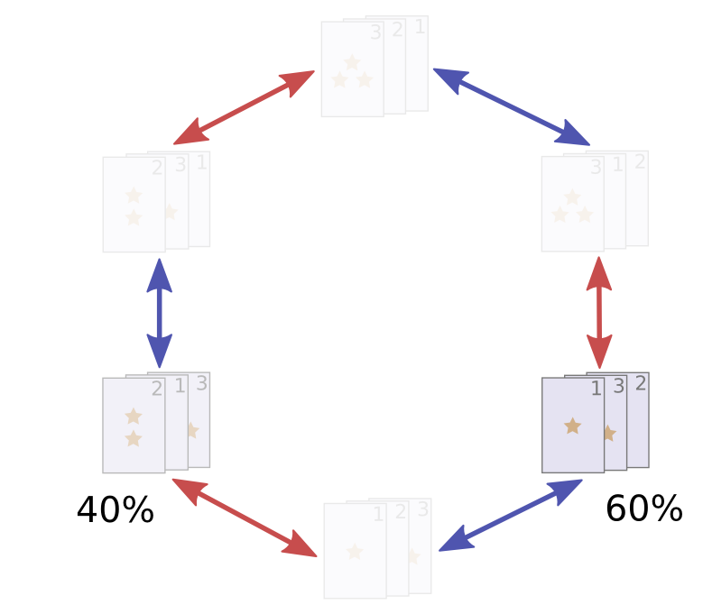

To be a bit more explicit, let's picture us as starting with all the probability density on the unpermuted cards $\cards{123}$ (ie. the identity), and then we apply our very silly shuffle. (Let's call the probability distribution $f$.)

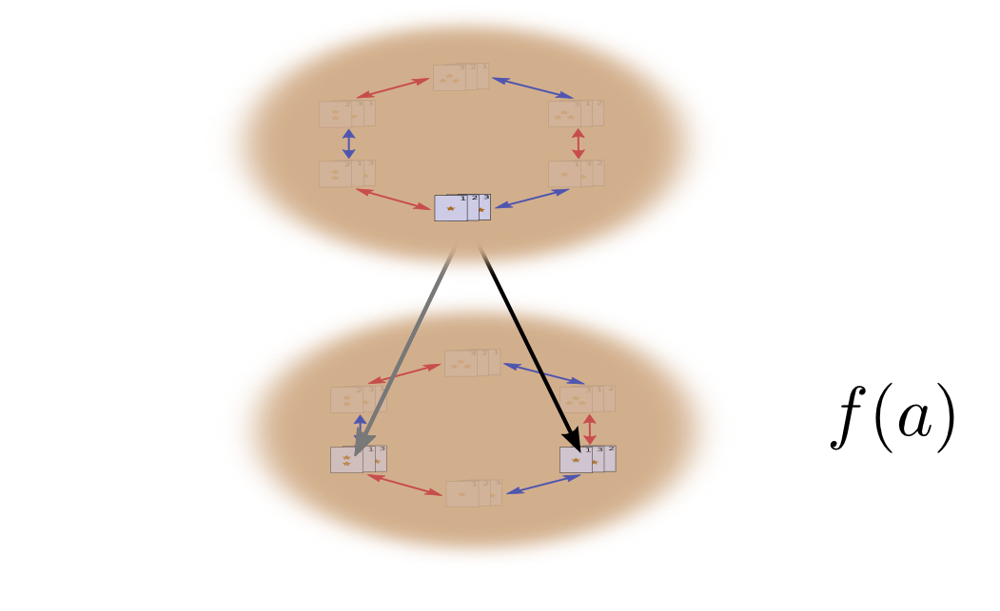

What happens when we shuffle a second time?

Well, let's think about this in two steps. The first time we shuffle, we get a permutation $a$ with probability $f(a)$. The second time we shuffle, we get a permutation $b$ with probability $g(b)$. These two actions happen with probability $f(a)g(b)$ and result is a permutation $c = b\cdot a$.

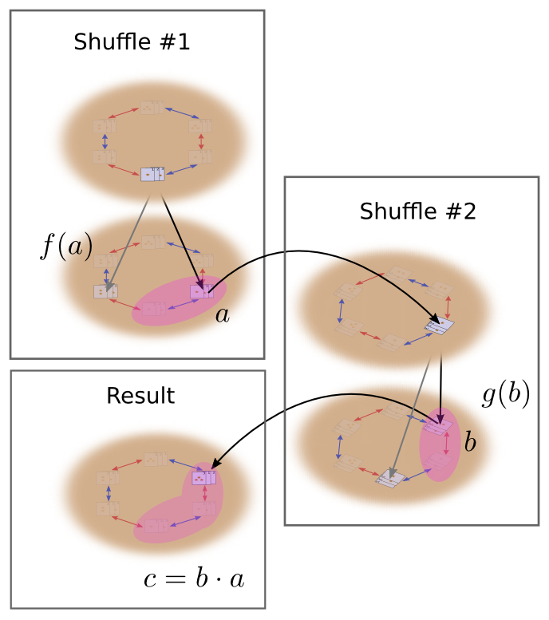

To get the actual probability of $c$, though, it is not sufficient to just look at one pair of permutations that bring us to $c$. Instead, we need to sum over all possible pairs of permutations. This is the convolution of $g$ and $f$ (like in function composition, the right side goes first).

$$(g\ast f)(c) = \sum_{b \cdot a = c} g(b)f(a)$$

Substituting $b = ca^{-1}$, we get:

$$(g\ast f)(c) = \sum_{a} g(ca^{-1})f(a)$$

This can be nicely thought of as a sum over the intermediate permutations, $a$, looking at the probability of that intermediate permutation, and the probability of the permutation necessary to bring us to $c$ from there.

Alternatively, we can substitute $a = b^{-1}c$ to get:

$$(g\ast f)(c) = \sum_{b} g(b)f(b^{-1}c)$$

The traditional definition of convolution.

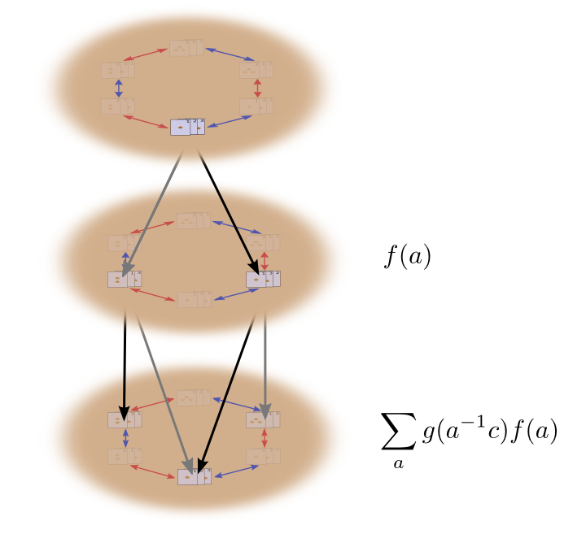

Further Generalizations of Convolution
======================================

(Less mathematical readers might wish to skip this section.)

The traditional definition of convolution requires that you be able to take inverses, and multiply every element by every other element. This means you need to be working on a group, or perhaps a quasigroup.

But if you switch to the definition $(g\ast f)(c) = \sum_{b \cdot a = c} g(b)f(a)$, which seems much more natural, convolution makes sense on just about any algebraic structure with a binary operator. Certainly, you can talk about convolutions on monoids, groupoids, and categories. As far as I can tell, no one's really considered these.

One cute thing about this is that convolution often inherits the algebraic properties of the domains of the functions being convolved. For example, if you convolve functions on associative domains, the convolution operation is associative:

$$((A\ast B) \ast C)(x) = \sum_{a \cdot b \cdot c = x} A(a)B(b)C(c) = (A\ast (B \ast C))(x)$$

Similarly, if the domain is commutative, so is convolution. And if it has identity, so does convolution. Sadly, convolution doesn't get inverses if the domain has inverses, so the parallel breaks down at Abelian loops.

With the math working out so nicely, you might wonder if there's any reason one might actually use these. Well, convolution on monoids seems natural in cases where you "can't go backwards". And convolution on categories allows for a kind of state. In fact, I think you could very naturally describe probabilistic automaton in terms of category convolutions.

Conclusion
===========

This essay takes an unusual perspective on group theory. Cayley diagrams have been around for a long time, but, as far as I know, taking them seriously as an approach to group theory is a recent idea, engineered by Nathan Carter in his book *Visual Group Theory*. Interested readers are encouraged to look at his book.

Group convolutions provide elegant language for talking about lots of situations involving probability. But, since this is a series of blog posts on *convolutional neural networks*, you may suspect that I have other interests in them. Well, you guessed correctly. Group convolutions naturally extend convolutional neural networks, with everything fitting together extremely nicely. Since convolutional neural networks are one of the most powerful tools in machine learning right now, that's pretty interesting. In our next post, we will explore these networks.

Next Posts in this Series
==========================

This post is part of a series on convolutional neural networks and their generalizations. The first two posts will be review for those familiar with deep learning, while later ones should be of interest to everyone. To get updates, subscribe to my [RSS feed](../../rss.xml)!

Please comment below or on the side. Pull requests can be made on [github](TODO!!!??????).

